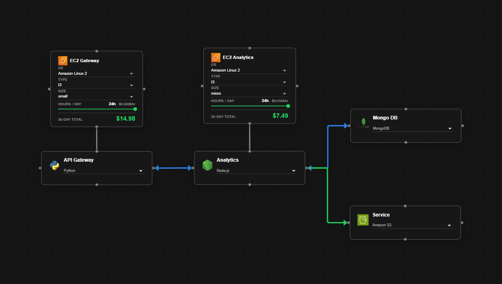

# Diagram-inator

> Lightweight visual editor for infrastructure-style diagrams, built with React and XY Flow.



---

[](https://react.dev)
[](https://vitejs.dev)
[](https://developer.mozilla.org/en-US/docs/Web/JavaScript)
[](https://mui.com)


---

## Overview

Diagram-inator is a small web app focused on creating node-based diagrams with a clean, modern UI.
It includes a dedicated diagram page, reusable node/edge types, and EC2-oriented context/data helpers.

## Quick Start

```bash
npm install
npm run dev
```

The app runs locally at `http://localhost:5173` (default Vite port).

## Scripts

| Command | Description |
|---|---|
| `npm run dev` | Start development server |
| `npm run build` | Build for production |
| `npm run preview` | Preview production build |
| `npm run lint` | Run ESLint |

## Project Structure

```text
src/
  diagram/   # Diagram editor, node/edge types, canvas
  home/      # Landing/home view
  shared/    # Router, theme, shared components/constants
```

## License

MIT
